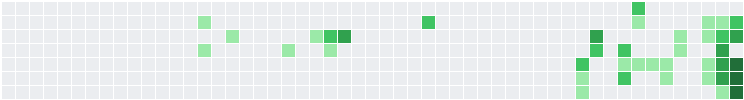

<!-- Intro Header -->

<h1 align="center">Hi,, I'm Colin </h1>

Graduate Researcher • Fusion Materials • Hydrogen/Tritium Permeation • ML for Materials • Sensor Systems

🧪 Contribution Diffusion Animation

This animation shows my GitHub contributions as a gas-phase diffusion simulation.

Each “molecule” starts on the left and undergoes a random walk—bouncing, permeating, and drifting across the lattice—just like a hydrogen or deuterium atom moving through a material.

 <!-- CHANGE: Switched from .svg (which GitHub disables animation for) to .gif -->  

👨‍🔬 About Me

I'm Colin Weaver — a mechanical engineering researcher focused on:

Hydrogen & tritium permeation in fusion-relevant materials Gas-driven permeation (GDP), multilayer coatings, irradiation effects, trapping, diffusion modeling.

Computational materials science FESTIM / FEniCS, reduced-order models, DFT/DMFT explorations, generative ML for material design.

Real-time sensor systems & data acquisition Arduino, LabJack, Raspberry Pi, Timeseries databases, live dashboards, and my lab-in-a-box DAQ platform.

Machine learning & scientific computing PINNs, transformers for molecular property prediction, optimization for NEMS/SAMs.

Surf data analytics Surfline API tools, wave-consistency metrics, long-term swell analysis.

I enjoy building systems that sit at the intersection of physics, computation, and real experiments.

🧰 Tech & Tools I Work With

Languages: Python, MATLAB, C++, q/kdb+, JavaScript/TypeScript

Frameworks & Tools: PyTorch, FEniCS/FESTIM, Qiskit, PyTorch Geometric, FastAPI, React, Node.js

Compute/Modeling: DFT/DFPT, DMFT, autoencoders, diffusion models, PINNs

Hardware & DAQ: Arduino, LabJack U6, Raspberry Pi, IMUs, thermocouples, vacuum systems

DevOps: GitHub Actions, containerized workflows, scheduled data pipelines

📈 Current Projects

🔭 Hydrogen permeation experiments & modeling Building GDP rigs, processing permeation flux data, modeling irradiation-induced traps.

🧠 Transformers for molecular and materials design Forward + inverse models for SAM molecules, high-performing QM9 property prediction, generative molecular design.

📦 Lab-in-a-Box Portable DAQ system for multi-sensor synchronized logging with a web-based visualization stack.

🌊 Surf analytics tools Automated daily Surfline forecast scraping + long-term swell and wave quality analysis.

📫 Connect

If you'd like to talk about fusion materials, scientific ML, sensor platforms, or interesting engineering problems, feel free to reach out!

Thanks for visiting — enjoy watching the diffusion animation drift across the lattice 🌬️

